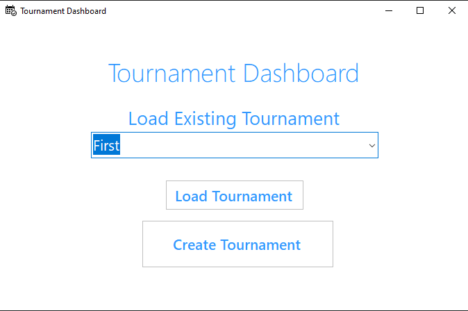

# Tournament Tracker

---
---
---

## Table of Contents
You're sections headers will be used to reference location of destination.

- [Description](#description)
- [How To Use](#how-to-use)
- [Author Info](#author-info)

---

## Description

Application to manage different kind of tournaments, handle tournaments, teams, matchups, results...

This application was made following a great online walkthroug course.

### Technologies

- C#, ASP.NET WinForms and Class Library
- SQL Server with Store Procedures
- Dapper

[Back To The Top](#read-me-template)

---

#### Installation

- Clone the repo.
- Run the SQL script in DB folder to create the DB
- Open the project in IDE 
- Create an App.config in Tracker UI root folder with at least the following

where value is your path to store the text files and Data Source is a connection string to your DB.
- Build the solution and run.

---

## Author Info

- Linkedin - [Federico Andrés Jácome Castañeda](https://www.linkedin.com/in/federicojacome/k)
- Website - [To be added]()

[Back To The Top](#read-me-template)
